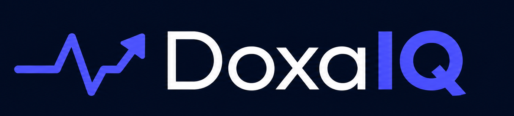

<div align="center">



# DoxaIQ — Customer Retention Dashboard

**See who's at risk. Act before they leave. Recover lost revenue.**

A premium customer retention and follow-up dashboard built for SME businesses — helping owners see who hasn't returned, who is at risk of churning, what complaints are unresolved, and how much revenue is quietly slipping away. All in one place.

[](https://react.dev)
[](https://www.typescriptlang.org)
[](https://vitejs.dev)
[](https://tailwindcss.com)
[](https://tanstack.com/router)
[](https://www.framer.com/motion)

</div>

---

## The Problem

Most SME business owners track customers via WhatsApp, spreadsheets, or memory. They have no visibility into:

- Which customers haven't returned in 30, 60, or 90+ days
- Who is quietly drifting toward churn right now
- Which complaints are still unresolved and escalating
- How much revenue is at risk from lapsed customers

**DoxaIQ answers all of this in one premium dashboard.**

---

## Features

### Customer Intelligence
- **RFM Scoring** — Every customer scored on Recency, Frequency, and Monetary value (1–5), giving a single health number at a glance
- **Automatic risk segmentation** — Active / At-Risk / Lost / Churned, calculated from days since last purchase
- **Full customer profiles** — Purchase history, avg order value, top purchase, open follow-ups, open complaints, and a live RFM progress bar

### Retention Actions
- **Follow-up queue** — Daily action list sorted by urgency; mark done, reschedule, or escalate
- **Complaints tracker** — Log and resolve complaints per customer with full detail view and status pills
- **At-Risk & Lost views** — Filtered lists for immediate intervention

### Revenue Visibility
- **Revenue at Risk** — Calculated exposure from lapsed customers, segmented by risk level
- **Revenue Analytics** — 6-month area + bar charts: earned revenue, at-risk exposure, recovered revenue

### Analytics
- **Retention Analytics** — Cohort retention rates, churn trend, new vs returning split, customer segment breakdown
- **RFM Distribution** — Visual breakdown of where your customer base sits on the scoring scale

### Platform
- **Live notifications** — Unread count on topbar bell; mark read, bulk delete, filter by type (overdue / escalated / at-risk)
- **CSV Import** — Drag-and-drop upload, preview table before confirming, sample file download
- **Settings** — Tabbed: Appearance, Business profile, Risk thresholds (adjustable with +/−), Security (password, 2FA, active sessions)
- **Light + Dark mode** — Full CSS variable theming, persisted across sessions

---

## Tech Stack

| Layer | Library |
|---|---|
| Framework | React 19 |
| Language | TypeScript 6 |
| Build | Vite 8 |
| Styling | Tailwind CSS v4 |
| Routing | TanStack Router v1 (file-based) |
| Server state | TanStack React Query v5 |
| Client state | Zustand v5 |
| Animations | Framer Motion v12 |
| Charts | Recharts v3 |
| Icons | lucide-react |
| Forms | react-hook-form + Zod |
| Toasts | react-hot-toast |
| Font | Satoshi (self-hosted OTF) |
| Utilities | clsx + tailwind-merge (`cn()`) |

---

## Getting Started

```bash
# Clone
git clone https://github.com/EmmanuelEyamah/cr-dashboard.git
cd cr-dashboard

# Install
npm install

# Run dev server
npm run dev
```

Open [http://localhost:5173](http://localhost:5173)

```bash
# Production build
npm run build

# Preview build
npm run preview
```

---

## Project Structure

```
src/
├── components/
│   ├── Sidebar.tsx
│   ├── Topbar.tsx
│   └── shared/            # RiskBadge, EmptyState, ErrorState
├── data/                  # All mock data (no backend)
│   ├── customers.ts
│   ├── followUps.ts
│   ├── complaints.ts
│   └── analytics.ts
├── pages/
│   ├── Dashboard/
│   ├── Customers/         # List, Profile, AddCustomer, AtRisk, Lost
│   ├── FollowUps/         # Queue, Detail, Schedule
│   ├── Complaints/        # Log, Detail
│   ├── Analytics/         # Retention, Revenue
│   ├── Notifications/
│   ├── Settings/
│   └── Import/
├── routes/                # TanStack Router file-based routes
│   ├── customers/         # index.tsx · $id.tsx · new.tsx
│   ├── follow-ups/        # index.tsx · $id.tsx · new.tsx
│   ├── complaints/        # index.tsx · $id.tsx
│   └── analytics/         # retention.tsx · revenue.tsx
├── stores/
│   ├── useSettingsStore.ts
│   └── useNotificationStore.ts
├── types/
└── lib/utils.ts           # cn() only
```

---

## All Routes (18 screens)

| Route | Page |
|---|---|
| `/` | Dashboard — command centre |
| `/onboarding` | First-run setup wizard |
| `/customers` | Customer list with filters |
| `/customers/:id` | Customer profile + RFM |
| `/customers/new` | Add / edit customer |
| `/at-risk` | At-risk customer view |
| `/lost` | Lost customer view |
| `/follow-ups` | Follow-up queue |
| `/follow-ups/:id` | Follow-up detail |
| `/follow-ups/new` | Schedule a follow-up |
| `/complaints` | Complaints log |
| `/complaints/:id` | Complaint detail |
| `/revenue` | Revenue at risk |
| `/analytics/retention` | Retention analytics |
| `/analytics/revenue` | Revenue analytics |
| `/import` | CSV import |
| `/notifications` | Notifications centre |
| `/settings` | Settings (tabbed) |

---

## How RFM Scoring Works

RFM is the industry-standard customer health model used by banks, e-commerce platforms, and enterprise CRMs. DoxaIQ makes it visible to SME owners who would never normally have access to it.

| Dimension | What it measures | Score 5 | Score 1 |
|---|---|---|---|
| **R**ecency | Days since last purchase | Bought this week | 90+ days ago |
| **F**requency | Total number of purchases | 10+ orders | First-time buyer |
| **M**onetary | Total amount spent | High lifetime value | Low lifetime value |

The overall score (average of R + F + M) drives the risk label automatically. Scores and thresholds are shown on every customer profile and list view.

---

## Risk Thresholds

| Status | Condition | Action |
|---|---|---|
| 🟢 **Active** | Last purchase ≤ 30 days | — |
| 🟡 **At-Risk** | 31 – 60 days | Schedule a follow-up |
| 🟠 **Lost** | 61 – 90 days | Win-back campaign |
| 🔴 **Churned** | 90+ days | Revenue at risk |

Thresholds are adjustable in **Settings → Thresholds**.

---

## Design System

| Token | Value |
|---|---|
| Primary | `#6366f1` (Indigo) |
| Accent | `#8b5cf6` (Violet) |
| Dark background | `#09090b` |
| Dark card | `#111118` |
| Font | Satoshi (self-hosted) |
| Radius | `0.625rem` |
| Mode | Light + Dark |

Animations are handled by Framer Motion v12 — page transitions (`AnimatePresence`), staggered card entrances, animated RFM rings, spring-based nav indicators, and hover micro-interactions throughout.

---

## Data

All data is **mock and static** — no backend, no database, no authentication required. This is a frontend-only prototype for client demos.

Mock data in `src/data/` includes:
- 20 Nigerian SME customers with realistic names, varied risk levels, and purchase history
- 6 months of purchase and revenue data
- Follow-ups, complaints, and analytics datasets

---

## Author

Built by **Emmanuel Eyama** · [DOXA](https://github.com/EmmanuelEyamah)

> DoxaIQ is a demo prototype built to show Nigerian SME business owners what a modern, intelligent customer retention system looks like — before they decide to build one with DOXA.

---

<div align="center">
  <sub>All customer data shown in this prototype is entirely fictional.</sub>
</div>
